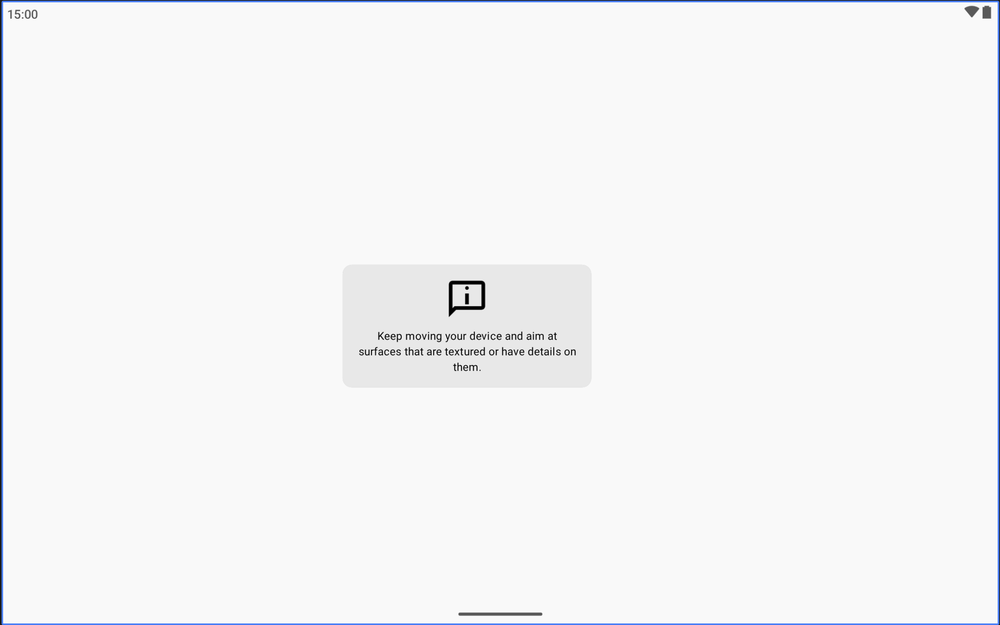
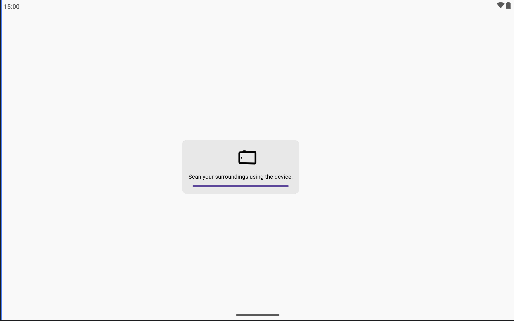
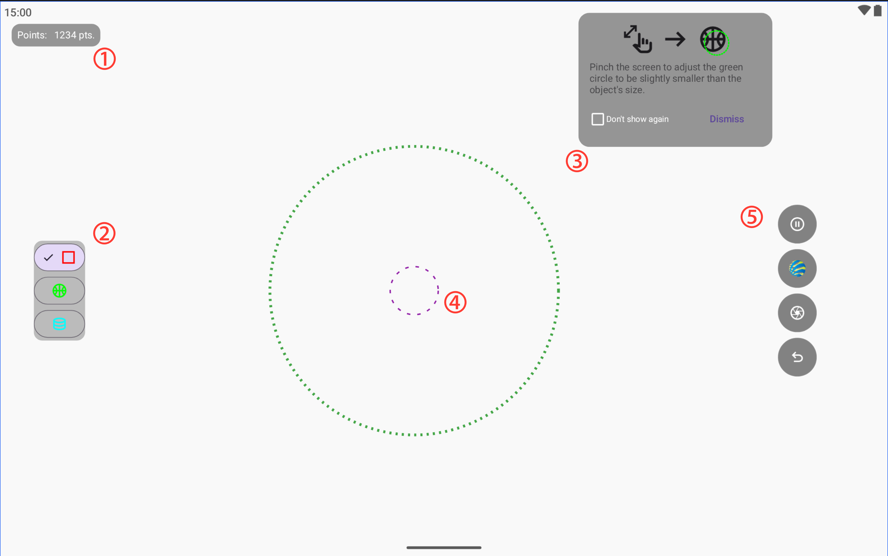
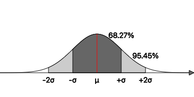

# FindSurface-GUIDemo-Android-FeaturePoint (Kotlin)

**Curv*Surf* FindSurface™** GUIDemo using ARCore raw feature points for Android (Kotlin)

[FindSurface](https://github.com/CurvSurf/FindSurface) / [FindSurface-Android](https://github.com/CurvSurf/FindSurface-Android)

## Overview

This demo app showcases a real-time application of FindSurface to detect geometric shapes in point clouds provided by ARCore.

The project retrieves [ARCore's `PointCloud`](https://developers.google.com/ar/reference/java/com/google/ar/core/PointCloud), which is the result of [`frame.acquirePointCloud()`](https://developers.google.com/ar/reference/java/com/google/ar/core/Frame#acquirePointCloud()), then uses FindSurface to detect geometry and overlays the results in AR rendering.

This demo runs on any Android devices with Android OS 11 (SDK 30) or later, with ARCore supported.  

See what it looks like in action in the video below.

[](https://www.youtube.com/watch?v=UxBIon3GnXs)

Click the thumbnail above or [here](https://www.youtube.com/watch?v=UxBIon3GnXs) to watch the video on YouTube.

## Features

- Real-time detection of geometric surfaces in camera scenes;  
- Uses input raw feature points provided by ARCore;  
- Detected surfaces rendered as overlays (AR rendering);  
- A UI designed for simple and intuitive detection;  
- Filters samples of raw feature point cloud statistically. [See below for details](#about-filtering-pointcloud).


## Importing FindSurface-Android

This project doesn't include FindSurface library for Android (AAR), so you have to download [here](https://github.com/CurvSurf/FindSurface-Android/releases/v1.0.2) and put the following line into your build.gradle.kts:

```kotlin
dependencies {
    ... your other dependencies here ...
    implementation(files(<path-to-the-library>/FindSurface-release.aar))
}
```

> Q. **Why do I need to download the file manually and specify its path? Can't I use Maven?**
>
> A. We are preparing a proper distribution option that allows FindSurface to be used more conveniently in Android projects, just like Swift Package on iOS.  
> In the meantime, please bear with us and use this approach.


## User Interface



1. When the app starts, a screen requesting you to scan your surroundings appears (as shown above).  
   This is a pre-stabilization step to ensure smooth AR experience by allowing the device’s motion tracking to stabilize.  
   Move your device smoothly as if scanning the surroundings with the camera. Once the progress bar at the bottom of the popup fills completely, the stabilization phase is complete.



2. During the stabilization phase, the progress may not advance and the guidance window will remain if:  
   - The device is stationary and the camera keeps seeing the same image;  
   - The camera is pointed at walls or surfaces lacking color, texture, or detail, or showing highly repetitive patterns;  
     (e.g., a plain solid-colored wall or a glass window)  

   *[ARCore’s `PointCloud`](https://developers.google.com/ar/reference/java/com/google/ar/core/PointCloud) are detected within about 65m, but the farther the distance, the larger the error, which can cause the point cloud’s quality (i.e., its accuracy) to deteriorate.*



3. After stabilization, the main screen appears (as shown above):  

   - **①**: Displays the number of points currently visible on the screen.  
   - **②**: Lets you select the type of geometry to detect. Plane, sphere, and cylinder are supported.  
   - **③**: The green dotted circle represents the approximate size of the geometry to detect. You can adjust its size with a pinch gesture. Generally, setting it slightly larger than half the size of the actual object is recommended. (Note: precision is not critical here.) A tutorial window in the center explains these details; you can dismiss it if no longer needed. Checking *“Don’t show again”* ensures the popup will not appear even after restarting the app.  
   - **④**: To detect geometry, ensure that some of the nearby points fall inside the purple dashed circle. The size of this circle cannot be adjusted.  
   - **⑤**: From top to bottom, the following controls are available:  
     - **Point collecting toggle button**: Enables/disables point collection from the environment. The toggle is set to `enabled` by default (stop button visible). Long pressing the button (holding for about 0.5 seconds) clears the point buffer collected so far.  
     - **FindSurface toggle button**: Runs FindSurface detection on every frame and shows a preview of the detected geometry at the current pointing location. The toggle is set to `enabled` by default (disabled state shown with grayscale icon).  
     - **Capture button**: Captures the currently previewed geometry and places it as a fixed AR overlay in space.  
     - **Undo button**: Removes the most recently captured geometry. Long pressing the button (holding for about 0.5 seconds) removes all captured geometry.  

*Note: Unlike the image shown above, in runtime the background will display the live scene from the device’s camera instead of a white background.*  


### When Geometry or Point Clouds Appear in the Wrong Place

This app does not provide a feature to reload previously placed content after the device restarts or the app is terminated and relaunched. As long as the app remains in memory, it may resume from an inactive state and show the previous content as-is, but this is not always guaranteed.

In addition, as is sometimes seen in AR applications in general, when the running app becomes inactive (for example, when the Home button is pressed or the screen turns off briefly) and then returns, the following issues may occur:

- **AR content appears in the wrong place instead of where it was originally placed:**  
  Typically, ARCore can estimate the device’s movement during the pause–resume interval and restore the previous origin when the app resumes the session. If it fails, however, a new origin may be created at a different location, which causes the reference point of previously rendered content to shift. Scanning the surroundings may help ARCore rediscover the previously scanned area and restore the origin, but this is not guaranteed. In such cases, it is recommended to press and hold the **Point Collecting toggle button** and the **Undo button** for more than 0.5 seconds to reset and start a new session.

- **A drifting effect where content appears to endlessly float away:**  
  This can occur when motion tracking has not yet stabilized. It is recommended to scan the surroundings until the tracking stabilizes, then reset as described above, or alternatively, completely restart the app (see [this guide](https://support.google.com/android/answer/9079646?hl=en#zippy=%2Cclose-apps) for instructions).


## About Filtering `PointCloud`

ARCore’s [`PointCloud`](https://developers.google.com/ar/reference/java/com/google/ar/core/PointCloud) provides, for each frame, the feature points detected in that frame along with the identifier and a confidence value assigned to each point. If the same identifier appears in more than one frame, this means ARCore considers two features detected at different frames to be samples of the same identity. In other words, they are different samples of the same feature.  


As shown in the image above, while the camera is moving, ARCore’s algorithm detects features across multiple frames. Owing to the inherent nature of the algorithm (a detailed discussion of which is outside the scope of this document), the positions of samples of the same feature detected in different frames are not exactly identical but are instead distributed with some error.  


The error distribution forms a kind of needle shape: it has a large variance in the direction aligned to the camera’s viewing direction. The figure above shows an accumulation of [`rawFeaturePoints`](https://developer.apple.com/documentation/arkit/arframe/rawfeaturepoints) feature samples drawn, taken from a ball placed on the floor. You can see that the distribution of points forms a needle-like shape, converging in a particular direction. This is because the device was moved around and scanned from the side toward which the needle is pointing.  

> DISCLAIMER: The needle-shaped point cloud shown in this example is based on data from Apple’s ARKit. While Google’s ARCore produces a similar pattern, minor differences may occur due to variations in their underlying technologies. This explanation uses ARKit simply as an example to illustrate the concept of point-cloud distribution, not as a detailed technical comparison between ARKit and ARCore.  



Instead of simply averaging these samples, we use a **z-score filtering method** based on the distance of each sample from the mean position. We remove outlier samples that fall outside a certain range from the mean (±2σ, within 95%), and then use the mean of the remaining samples as the representative position of the feature. When new samples are added from other frames, we repeat the same filtering over the accumulated samples (keeping up to 100 per feature, discarding the oldest in FIFO manners if exceeded). If there is only a single sample, that point is used directly as the feature’s position without any statistical processing.  

Unlike ARKit, ARCore provides a confidence value for each sampled point. In our filtering process, we utilize these confidence values as weights when computing the weighted mean position and the variance of distances from the mean. Accordingly, instead of normalizing by the total number of samples, we divide by the **sum of the applied weights**.  


## Pushing ARCore to Its Limits

While Apple’s ARKit provides point data only within a 10‑meter radius via `rawFeaturePoints`, Google’s ARCore offers point data up to 65 meters through `frame.acquirePointCloud()`. This difference means that one of the two technologies is largely confined to indoor use, whereas the other opens up the possibility of testing FindSurface performance even on massive outdoor architectural structures.

[](https://www.youtube.com/watch?v=YRCeQBaCGZw)